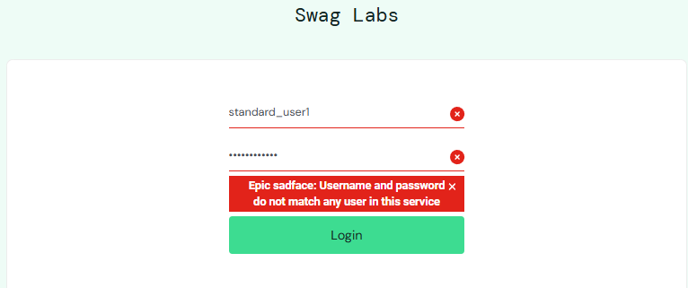
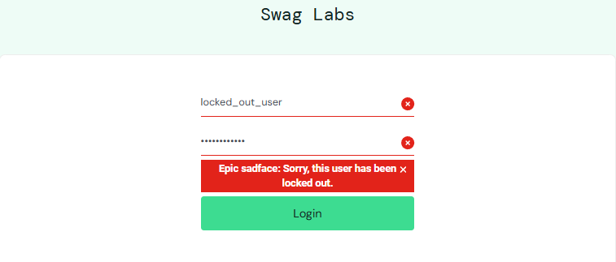
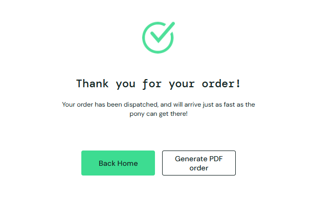
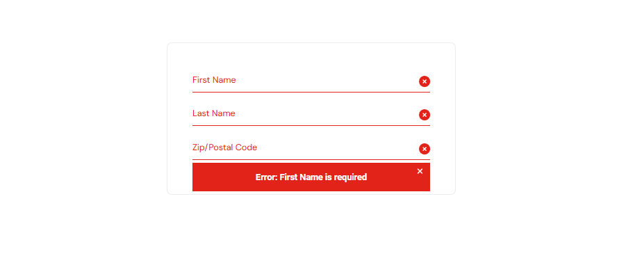

# Тест-кейсы

## TC-001 Успешная авторизация

- Предусловие: пользователь находится на странице логина

- Шаги:
  1. Ввести валидный `Username`
  2. Ввести валидный `Password`
  3. Нажать `Login`

- Ожидаемый результат: пользователь перенаправляется на страницу списка товаров

## TC-002 Неуспешная авторизация

- Предусловие: пользователь находится на странице логина

- Шаги:
  1. Ввести невалидный `Username`
  2. Ввести невалидный `Password`
  3. Нажать `Login`

- Ожидаемый результат: отображается сообщение об ошибке, пользователь остается на странице логина

## TC-003 Блокированный пользователь

- Предусловие: пользователь находится на странице логина

- Шаги:
  1. Ввести заблокированный `Username` (`locked_out_user`)
  2. Ввести валидный `Password`
  3. Нажать `Login`

- Ожидаемый результат: отображается сообщение о блокировке пользователя

## TC-004 Добавление товара в корзину

- Предусловие: пользователь авторизован и находится на странице каталога товаров

- Шаги:
  1. Выбрать товар
  2. Нажать `Add to cart`

- Ожидаемый результат: бейдж корзины увеличивается, товар появляется в корзине

## TC-005 Удаление товара из корзины

- Предусловие: Товар находится в корзине

- Шаги:
  1. Выбрать не нужный товар
  2. Нажать на кнопку `Remove`

- Ожидаемый результат: товар исчезает из корзины, бейдж обновляется

## TC-006 Сортировка товаров

- Предусловие: пользователь авторизован и находится на странице каталога товаров

- Шаги:
  1. Открыть выпадающий список сортировки
  2. Выбрать тип сортировки товаров `Price (low to high)`

- Ожидаемый результат: товары меняют порядок (отображаются по возрастанию цены)

## TC-007 Успешное оформление заказа

- Предусловие: В корзине есть минимум один товар

- Шаги:
  1. Нажать на кнопку `Checkout`
  2. Заполнить данные покупателя
  3. Нажать на кнопку `Continue`
  4. Подтвердить заказ путем нажатия на кнопку `Finish`

- Ожидаемый результат: заказ успешно оформлен, отображается confirmation message

## TC-008 Валидация обязательных полей
  
- Предусловие: Пользователь находится на форме оформления заказа

- Шаги:
  1. Оставить обязательные поля пустыми
  2. Нажать на кнопку `Continue`

- Ожидаемый результат: отображаются сообщения валидации

## TC-009 Соответствие изображений для карточек товаров

- Предусловие: Пользователь авторизован

- Шаги:
  1. Перейти на страницу каталога
  2. Визуально оценить изображения

- Ожидаемый результат: изображения соответствуют товарам и отображаются корректно
